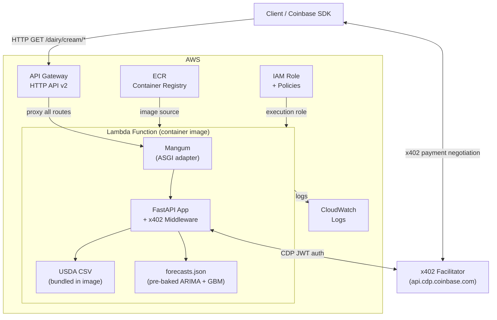

```mermaid
graph TB
    Client["Client / Coinbase SDK"]
    x402["x402 Facilitator\n(api.cdp.coinbase.com)"]

    subgraph AWS["AWS"]
        APIGW["API Gateway\nHTTP API v2"]

        subgraph Lambda["Lambda Function (container image)"]
            Mangum["Mangum\n(ASGI adapter)"]
            FastAPI["FastAPI App\n+ x402 Middleware"]
            Data["USDA CSV\n(bundled in image)"]
            Forecasts["forecasts.json\n(pre-baked ARIMA + GBM)"]
        end

        ECR["ECR\nContainer Registry"]
        CWLogs["CloudWatch\nLogs"]
        IAM["IAM Role\n+ Policies"]
    end

    Client -->|"HTTP GET /dairy/cream/*"| APIGW
    Client <-->|"x402 payment negotiation"| x402
    APIGW -->|"proxy all routes"| Mangum
    Mangum --> FastAPI
    FastAPI --> Data
    FastAPI --> Forecasts
    FastAPI <-->|"CDP JWT auth"| x402
    Lambda -->|"logs"| CWLogs
    ECR -->|"image source"| Lambda
    IAM -->|"execution role"| Lambda
```
